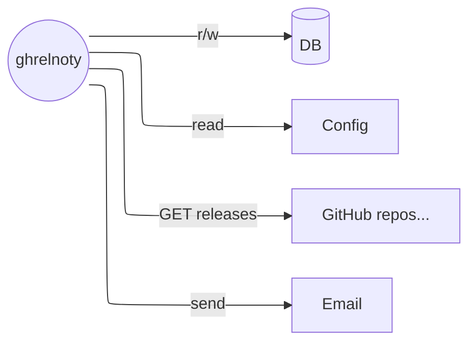
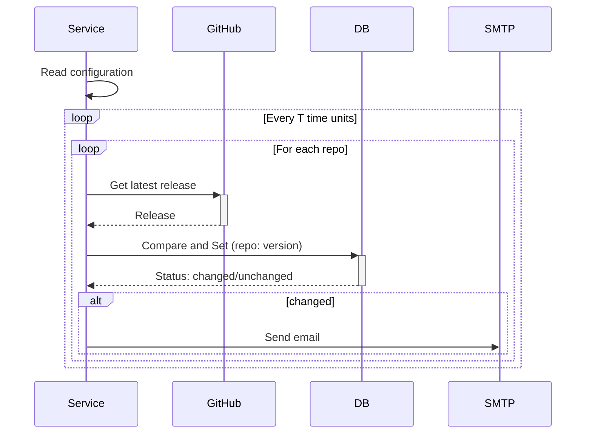

# GHRelNoty: GitHub Release NotifY

[](https://github.com/davquar/ghrelnoty/actions/workflows/ci.yaml)
[](https://github.com/davquar/ghrelnoty/actions/workflows/release.yaml)

_Get notified when projects you care about release new versions._

## What

This tool allows you to define a list of GitHub repository
to monitor for new releases, and get an email notification
in such case.

## Why

I have my watchlist of projects on GitHub for which I want to
know when new versions are released. However, this workflow has
the following limitations:

- Control is on GitHub: to get which projects I'm following for
  releases I have to use GitHub's UI/API.
- There is no way to disable email notifications for pre-releases,
  so I get overwhelmed by emails that I don't care about.

So that's why I made `ghrelnoty`: a tool that can be better
integrated in IaC workflows, and shifts control to my direction.

Is it an overkill? Probably, but I don't care.

The current version is extremely limited, only fitting my current
use-case and needs.

## Design

The tool is a glorified watcher for new releases on the GitHub
repos that are defined in the configuration.

When a new release is detected, an email notification is fired.

### Actors



### High level flow



### Database

ghrelnoty only needs to persist the current discovered release for
each repository. This data is stored in a [Bolt](https://github.com/etcd-io/bbolt) key-value store.

### Rate limiting

Unauthenticated requests are rate-limited to 60/h. To avoid hitting the
limit, ghrelnoty keeps an eye to the rate-limiting headers that are
included in GitHub's API responses, in order to avoid making new
requests when the limit is about to be hit (80%). If the limit is
hit, ghrelnoty pauses until the limit is reset.

In general, to help distribute requests over time in a very simple way,
there is a configurable amount of time to wait between requests.

### Metrics

ghrelnoty exports some metrics at `/metrics`, behind a configurable
port:

|Metric|Type|Description|
|---|---|---|
|`ghrelnoty_db_open_errors_total`|Counter|Total number of databse open errors|
|`ghrelnoty_db_errors_total`|Counter|Total number of databse errors|
|`ghrelnoty_rate_limit_risks_total`|Counter|Total times there was a risk of hitting rate limits|
|`ghrelnoty_rate_limited_total`|Counter|Total times rate limits were hit|
|`ghrelnoty_github_rate_limit`|Gauge|Value of GitHub's rate limit|
|`ghrelnoty_github_rate_limit_used`|Gauge|Current usage of GitHub's rate limit|
|`ghrelnoty_release_get_errors_total`|Counter|Total times it was not possible to get the latest release|
`ghrelnoty_new_releases_founds_total`|Counter|Total times a new release was found|
|`ghrelnoty_notification_errors_total`|Counter|Total times there were problems notifying|

## Usage

ghrelnoty can be run with:

```shell
ghrelnoty --config-path config.yaml
```

Alterntively, the configuration path can be specified with the
environment variable `GHRELNOTY_CONFIG_PATH`. The command line
flag has precedence.

### Docker

```shell
docker pull ghcr.io/davquar/ghrelnoty
```

Docker-compose example in [/demo/docker-compose.yaml](/demo/docker-compose.yaml). 

### Configuration

ghrelnoty's configuration must be defined in YAML.
Check out [/demo/config.yaml](/demo/config.yaml) for an example.

## Roadmap

### v0

This version is an MVP for myself, supporting GitHub and email.

### Useful functionalities to include over time

- Notifications template.
- Include/exclude releases by regex.
- Support other destinations (like Telegram, Slack, Mattermost, ...).
- Support other forges (like GitLab, ...).
  - Smart forge detection.
- Aggregate email

## Authors

- [Davide Quaranta](https://github.com/davquar)