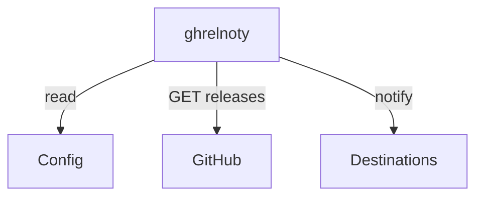

# GHRelNoty: GitHub Release NotifY

Get notified when projects you care about release new versions.

This project is meant to be used instead of GitHub's native
notifications on new releases, for people who want to have more
control; specifically, this project allows you to:

- Configure projects as code.
- Include/Exclude prereleases.

The current version is extremely limited, only supporting
GitHub and e-mail notifications.

## Design



### Configuration

```yaml
repositories:
  - name: author/repo
    type: github
    prereleases: false
    destination: email
destinations:
  email:
    type: email
    from: ghrelnoty@example.com
    to: to@example.com
  telegram:
    type: telegram
    chatid: xxx
    token: bot-token-xxx
```

## Roadmap

### v0

This version is an MVP for myself, only consisting of:

- Forges support: GitHub.
- Destinations support: email.

### Useful functionalities to include over time

- Notifications template.
- Include/exclude releases by regex.
- Support other destinations (like Telegram, Slack, Mattermost, ...).
- Support other forges (like GitLab, ...).
- Smart forge detection.